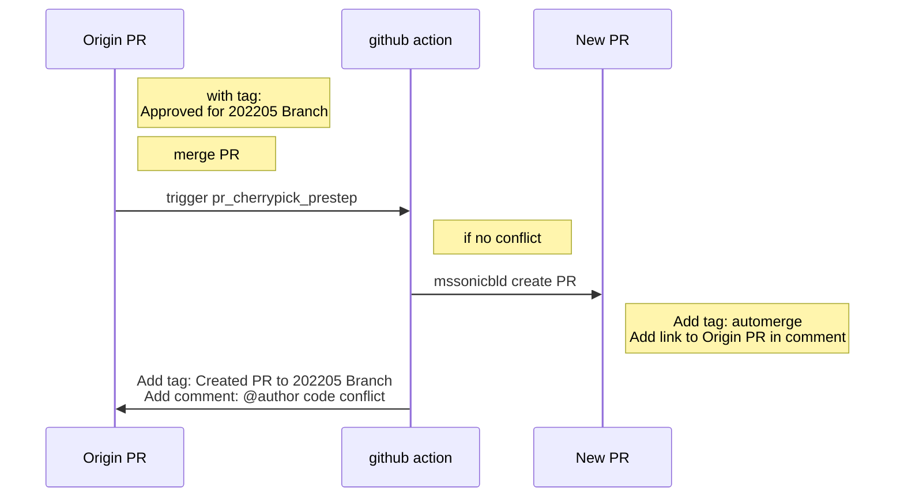
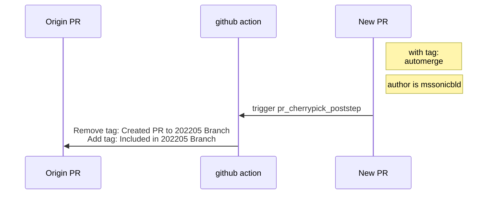

# Github actions README

This is an introduction about auto-cherry-pick workflow.

take 202205 branch for example:
1. pr_cherrypick_prestep:

2. automerge:  automerge will merge PRs when its author is mssonicbld and its PR checks passed.
3. pr_cherrypick_poststep:

