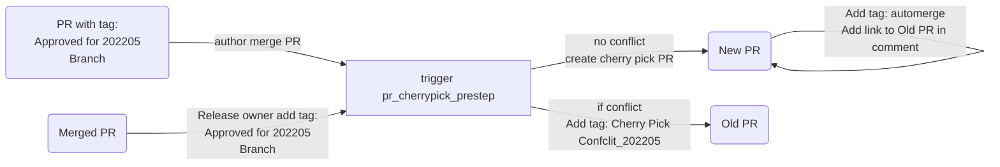
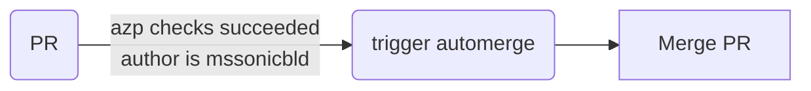
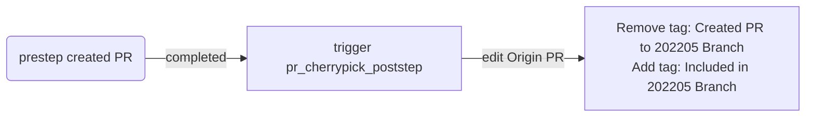

# Github actions README

This is an introduction about auto-cherry-pick workflow.

The workflow only works for release branches, such as 202???,201811,201911. Let's take 202205 branch as an example:
1. pr_cherrypick_prestep:

2. automerge:  automerge will merge PRs when its author is mssonicbld and its PR checks passed.

3. pr_cherrypick_poststep:

